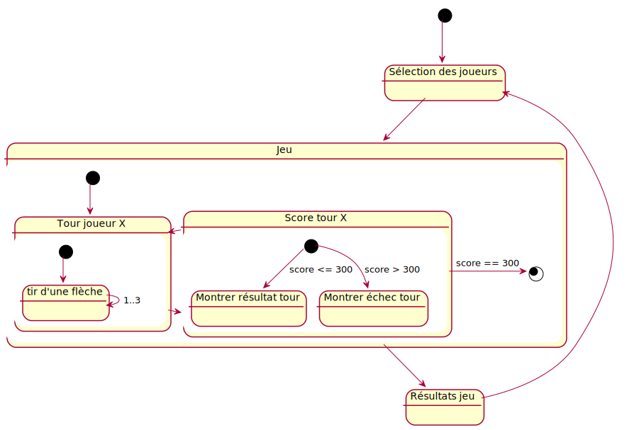
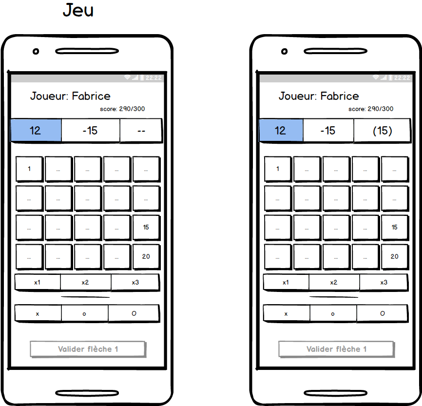
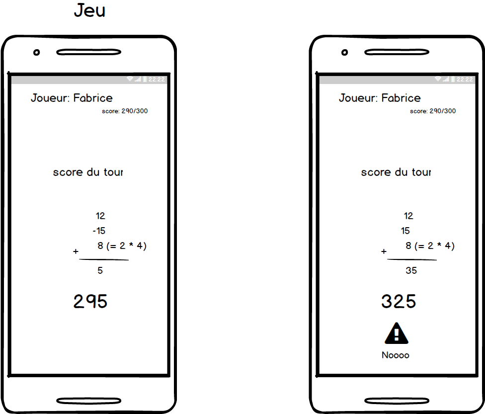
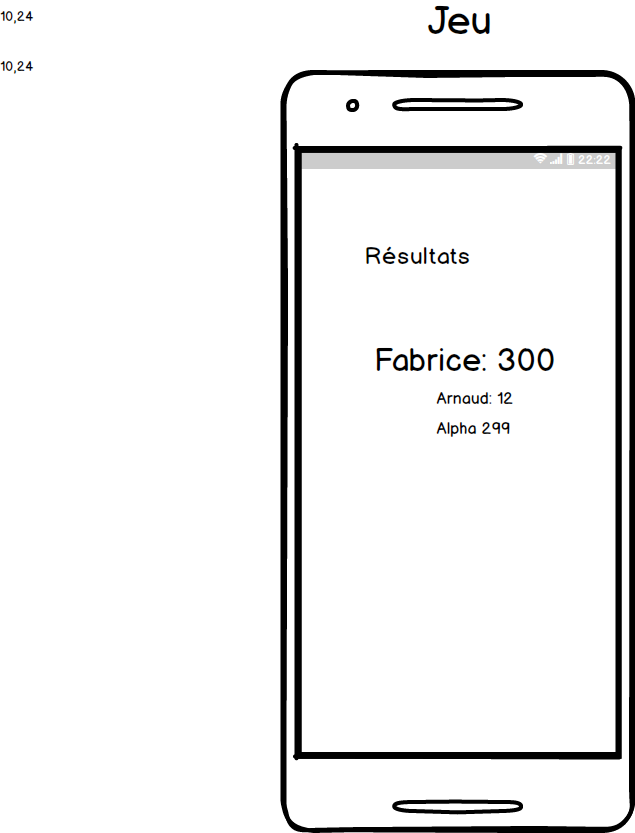

# Meetup 5 - Flechettes Lausannoises

## Contexte

Meetup : https://www.meetup.com/fr-FR/React-Native-enthusiasts-and-entrepreneurs/

Ce meetup a pour thème la réalisation d'un projet React Native from scratch en Mob Programming.
Ce projet porte sur le jeu des Fléchettes Lausannoises : Il doit aider un joueur à enregistrer les scores et faire le suivi des parties.

## Logique impliquée
- Gestion des joueurs : Saisie des noms des joueurs
- Gestion des scores  : Démarrage 0 points, victoire à 300 points
- Gestion du flow de partie : 3 lancers par joueur, puis passage au joueur suivant
- Calcul des points : 
    - Somme des scores des 3 lancers avec gestion des combos (Si 3x le même score, bonus x2 sur le total)
    - Rejet du score de la dernière flèche lancée si elle fait dépasser la somme de l’objectif
    - Une flèche hors cible compte pour -15 points
- Modes additionnels :
    - Mode hardcore : si écart de 100 points ou plus, le score le plus bas est éliminé

### Diagramme d'état


## Interface utilisateur
### Saisie des joueurs


### Jeu


### Scores


### Résultats


## User Story Map


## Outils utilisés pour la doc
### Diagrammes: PlantUML
Utilisation de "PlantUML" ( http://plantuml.com/ )
Conseil utiliser l'extension VSCode PlantUML en mode PlantUML-Server ( Lire doc de l'extension VSCode )
#### Installation GraphViz: Linux
```
sudo apt install python-pydot python-pydot-ng graphviz
```
### Installation GraphViz: OSX
```
brew install graphviz
```
Pour rendu rapide:
https://github.com/plantuml/plantuml-server

### Mockups
Balzamiq ( https://balsamiq.com/ )

### User Story Mapping
Utilisation du service "Story On Map" ( https://storiesonboard.com/ )

## Pré-requis 

### node 10.13 

Le gestionnaire de version de node peut-être utile [nvm](https://github.com/creationix/nvm).

Il peut également être installé avec brew `brew install nvm`

### react-native-cli

`npm install -g react-native-cli` 

### NPM vs YARN 
Dans un soucis de simplification des dépendances, choissisons un gestionnaire de dépendances commmun. 
Au hasard, npm.  

### Dépendencies 

  - [redux](https://redux.js.org)
  - [react-redux](https://react-redux.js.org): React bindings for Redux
   
  
  
  
